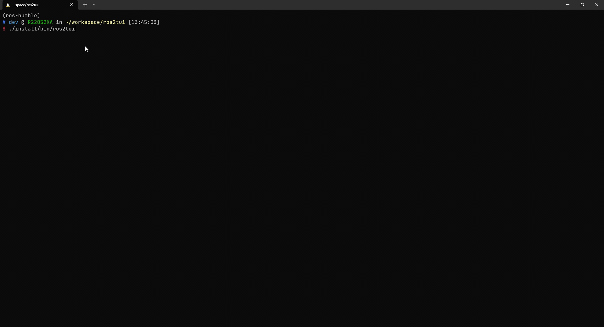
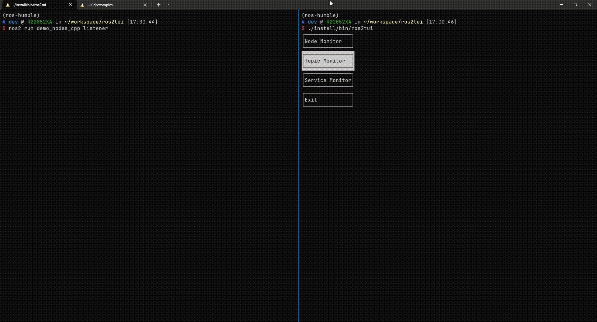

# ROS Terminal UI based on [ftxui](https://github.com/ArthurSonzogni/ftxui) and [dynmsg](https://github.com/osrf/dynamic_message_introspection)


## Prerequisites

[ROS Humble and above](https://docs.ros.org/en/humble/index.html)

## BUILD

```
mkdir -p ~/ros2tui_ws/src
cd ~/ros2tui_ws/src
git clone https://github.com/osrf/dynamic_message_introspection
git clone https://github.com/uupks/ros2tui

cd ~/ros2tui_ws
colcon build --merge-install --packages-up-to ros2tui --cmake-args -DBUILD_TESTING=OFF
```

## Example

- Topic Echo and Info
    - `Tab` navigate between the topic list and topic info container
    - `ESC` exit when focused on topic list container

    

- Topic Pub
    - `Enter` reset topic message yaml string
    - `Publish` publish message once

    
